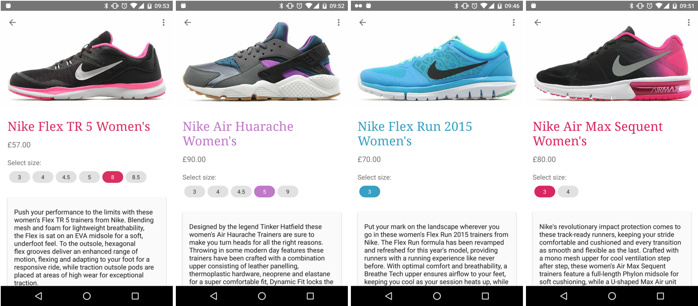

# ChipCloud
[](https://jitpack.io/#fiskurgit/ChipCloud) [](https://github.com/fiskurgit/ChipCloud/blob/master/LICENSE) [](https://www.codacy.com/app/fiskur/ChipCloud?utm_source=github.com&amp;utm_medium=referral&amp;utm_content=fiskurgit/ChipCloud&amp;utm_campaign=Badge_Grade)

# Note. DEPRECATED: Google have added `Chip` and `Chip Group` to the [28.0.0 Design library](https://developer.android.com/topic/libraries/support-library/revisions.html#28-0-0-alpha1), so I recommend using that.

An easy to use implementation of Google's [Material Design 'Chip' ui element](https://material.io/guidelines/components/chips.html). Version 3 was a fresh rewrite of the original quickly hacked together library, version 3.0.4 introduces support for images/avatars and the close icon and matches the Google spec. The previous iteration was becoming popular as an easy replacement for a dropdown/spinner with improved UX and more efficient use of screen real estate. Versions 3+ have an improved API with a fraction of the code. The biggest change is it's now not a custom Layout, it's a simple helper class that adds Chips to a supplied ViewGroup, complex layout is delegated to dedicated layout libraries such as FlexboxLayout.



## Usage

Although ChipCloud can be used with any ViewGroup to get the wrapping 'Chip Cloud' that was the original focus of the library you should use [Google's FlexboxLayout](https://github.com/google/flexbox-layout) - see the demo project for a full example.


```java
//To create the same wrapping cloud as previous incarnation use Google's FlexboxLayout:
FlexboxLayout flexbox = (FlexboxLayout) findViewById(R.id.flexbox);

//Create a new ChipCloud with a Context and ViewGroup:
ChipCloud chipCloud = new ChipCloud(this, flexbox);

//Add a single Chip:
chipCloud.addChip("HelloWorld!");

//or pass a List or Array of any Object:
String[] demoArray = getResources().getStringArray(R.array.demo_array);
chipCloud.addChips(demoArray);
```

## Customisation

Use the ChipCloudConfig builder to customise colors, fonts, turn padding on, and set select mode:

```
FlexboxLayout flexbox = (FlexboxLayout) findViewById(R.id.flexbox);

ChipCloudConfig config = new ChipCloudConfig()
    .selectMode(ChipCloud.SelectMode.multi)
    .checkedChipColor(Color.parseColor("#ddaa00"))
    .checkedTextColor(Color.parseColor("#ffffff"))
    .uncheckedChipColor(Color.parseColor("#efefef"))
    .uncheckedTextColor(Color.parseColor("#666666"))
    .useInsetPadding(true)
    .typeface(someCustomeTypeface);

ChipCloud chipCloud = new ChipCloud(this, flexbox, config);
```

## Images/Avatars


Pass a drawable when you create a chip, they'll be made round and scaled to 32dp, but pass appropriately sized images - scaling images is expensive:

```java
ChipCloud avatarChipCloud = new ChipCloud(this, avatarLayout, chipcloudConfig);
drawableChipCloud.addChip("Anna A", ContextCompat.getDrawable(this, R.drawable.anna_a));
```

## Delete/Remove

With avatars:  


Labels only:  


Use `showClose` in ChipCloudConfig, the colour is the tint for the cross icon, the long value is an optional fadeout time when the chip is deleted:

```java
    ChipCloudConfig chipcloudConfig = new ChipCloudConfig()
        .selectMode(ChipCloud.SelectMode.multi)
        .checkedChipColor(Color.parseColor("#ddaa00"))
        .checkedTextColor(Color.parseColor("#ffffff"))
        .uncheckedChipColor(Color.parseColor("#e0e0e0"))
        .uncheckedTextColor(Color.parseColor("#000000"))
        .showClose(Color.parseColor("#a6a6a6"), 500);
```

alternatively just use `.showClose(Color.parseColor("#a6a6a6")` and the chip will pop with no animation. Add a listener so you can update your model when a user deletes a chip (the index <b>will</b> shuffle so you must do this, or you'll have issues):

```java
    deleteableCloud.setDeleteListener(new ChipDeletedListener() {
      @Override
      public void chipDeleted(int index, String label) {
        Log.d(TAG, String.format("chipDeleted at index: %d label: %s", index, label));
      }
    });
```

## Modes

### Multi  
`ChipCloud.SelectMode.multi`

The default mode; multiple chips can be selected.

### Single
`ChipCloud.SelectMode.single`

Only one chip can be selected at a time.

### Mandatory
`ChipCloud.SelectMode.mandatory`

Similar to a RadioGroup, only one chip can be selected, and once one has been chosen it's not possible to deselect it, you can click on another chip but one will always be checked.

### None
`ChipCloud.SelectMode.none`

No interaction, the chips just act as feedback for a user (eg. to display a list of tags associated with a news article).

## Dependency

Add jitpack.io to your root build.gradle, eg:

```groovy
allprojects {
    repositories {
        jcenter()
        maven { url "https://jitpack.io" }
    }
}
```

then add the dependency to your project build.gradle:

```groovy
dependencies {
    compile fileTree(dir: 'libs', include: ['*.jar'])
    compile 'com.github.fiskurgit:ChipCloud:3.0.5'
}
```
You can find the latest version in the releases tab above: https://github.com/fiskurgit/ChipCloud/releases

More options at jitpack.io: https://jitpack.io/#fiskurgit/ChipCloud

## Licence

Full licence here: https://github.com/fiskurgit/ChipCloud/blob/master/LICENSE

In short:

> The MIT License is a permissive license that is short and to the point. It lets people do anything they want with your code as long as they provide attribution back to you and don’t hold you liable.
